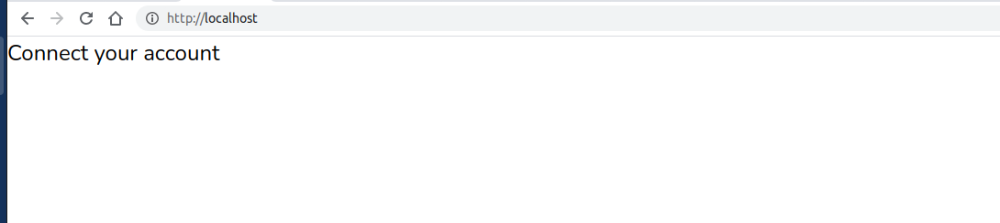
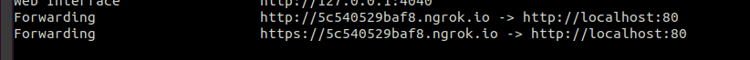

# OpenTicket.tech starter template

### What does this package do?
This is meant as starter package for start making applications related to [Openticket.tech](https://www.openticket.tech/), probaly also known as [Eventix](https://eventix.io/).
This package include all OAuth2 logic to get you up to speed, all token handling is taken care of.

### Starting (Docker required)
Based on [Laravel 8](https://laravel.com/docs/8.x/readme), and [sail](https://laravel.com/docs/8.x/sail).

Run the following commands:
```
git clone git@github.com:opentickettech/laravel-starter.git
cd laravel-starter
cp .env.example .env
composer install
bash vendor/bin/sail up -d
bash vendor/bin/sail artisan key:generate
bash vendor/bin/sail artisan migrate
```
Note: If the migrate commands fails, wait a moment (mysql takes some time to boot), application then should be running at http://localhost/.



### Connecting to Ticketing provider
Set the following env values:
```
OPENTICKETTECH_CLIENT_ID=
OPENTICKETTECH_CLIENT_SECRET=
OPENTICKETTECH_REDIRECT_URI=
```
Retrieve the `CLIENT_ID` and `CLIENT_SECRET` from dashboard https://dashboard.eventix.io/company/client.
Note: that you should set the **exact** same redirect value in the dashboard and the `OPENTICKETTECH_REDIRECT_URI` value, make sure to add `/redirect` at end of route.

### Local testing
For local testing you can install [https://ngrok.com/](https://ngrok.com/), to expose your local instance. When running `ngrok http 80` 
you get a public url:


set the env value `OPENTICKETTECH_REDIRECT_URI` and the redirect url of your Client in dashboard appropriately, make sure to add `/redirect` at end of route. 

### More information
[API docs - https://docs.openticket.tech/](https://docs.openticket.tech/)


### Samples
#### included routes:

| Domain | Method                                 | URI                                     | Name | Action  | Middleware |
| --------|----------|-------------------------------|------|---------|------------|
|        | GET,HEAD | /                                       |      | Closure | web        |
|        | POST     | api/webhook/{company_id}                |      | Closure | api        |
|        | GET,HEAD | company/{company_id}                    |      | Closure | web        |
|        | GET,HEAD | connect                                 |      | Closure | web        |
|        | GET,HEAD | dashboard                               |      | Closure | web        |
|        | GET,HEAD | logout                                  |      | Closure | web        |
|        | GET,HEAD | public/{company_id}                     |      | Closure | web        |
|        | GET,HEAD | public_encrypted/{encrypted_company_id} |      | Closure | web        |
|        | GET,HEAD | redirect                                |      | Closure | web        |


#### List of upcoming events
```php
Route::get('/company/{company_id}', function ($company_id) {
    $userId = Cookie::get('user_id');
    if (is_null($userId)) {
        return redirect('/');
    }
    $userObj = \App\Models\User::find($userId);
    $user = (object) Socialite::driver('opentickettech')->userFromToken($userObj->companyAccessToken->access_token);

    if(is_null($companyAccessToken = $userObj->allCompanyAccessTokens()->find($company_id))){
        abort(404, 'Company not found');
    }

    $client = new \Misc\Openticket\OTApi($companyAccessToken);
    $upcomingEvents = $client->get('/event/upcoming');

    return view('company', ['user' => $user, 'company' => $companyAccessToken, 'upcoming_events' => $upcomingEvents]);
});
```

#### Webhook code sample:
```php
Route::any('/webhook/{company_id}', function (Request $request, $company_id) {
    $companyAccessToken = CompanyAccessToken::find($company_id);
    if(is_null($companyAccessToken)){
        abort(404, 'Company not found');
    }

    $orderId = $guid = $request->get('guid');
    $client = new OTApi($companyAccessToken);
    $order = $client->get("/order/$orderId");

    Log::info("New order: $order->email ($order->guid)");

    // Do stuff with order or something else

    // Signal success, any content will do, but retrying is stopped after status code 200
    return response('' , 200);
});

```


### Contact

apiteam@eventix.io
